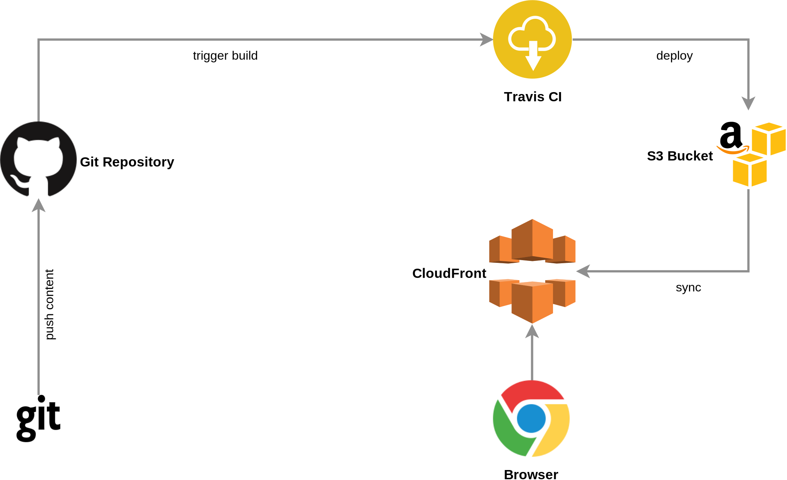

# sebastianvoss.com

[](https://travis-ci.org/sebastianvoss/sebastianvoss.com)



## Setup

```brew install hugo```

## Add Post

```hugo new -s src posts/my-first-post.md```

## Run local server

```
hugo server -s src -D
```

## References

[Hugo Documentation](https://gohugo.io/documentation/)
